# Gen AI Engineer Bootcamp: Build AI Apps & Agents in Python

Del curso de Udemy: https://www.udemy.com/course/ai-developer-bootcamp/

Al clonar este repositorio, cambiar el nombre de `.env.template` a `.env` e indicar los valores correctos.

## Introduction to AI Powered Apps

### Creating an AI-Powered App with Python

En este clase vamos a aprender a hacer programas Python que se conectan a LLM, envían un texto y obtienen del LLM una respuesta.

En la carpeta `00-Projects` vamos a crear un entorno virtual y a usarlo.

- Crear un entorno virtual de Python (esto solo una vez para todos los proyectos): `python -m venv .venv`
- Usar al entorno virtual: `source ./.venv/bin/activate`

Instalamos las librerías que vamos a necesitar.

- `pip install langchain`
  - Es el framework que usaremos para conectarnos a los LLM.
- `pip install langchain-google-genai`
  - Necesario para que Langchain pueda conectarse a los modelos de Gemini.
- `pip install python-dotenv`
  - No es necesario para nada de IA.
  - Es para poder usar archivos `.env`

Necesitaremos una API key gratuita para los modelos Gemini AI de Google.

- Acceder a https://aistudio.google.com/api-keys
- Pulsaremos sobre el botón `Crear clave de API`.
- Primero creamos el proyecto.
  - En la ventana que aparece, selecconar en el desplegable `Create project`.
  - Indicar el nombre del proyecto. En mi caso he dejado el por defecto: `Gemini Project`.
- Ahora vamos a crear una key para ese proyecto.
  - En la ventana, seleccionamos el proyecto que acabamos de crear.
  - Pulsamos en el botón `Crear clave`.
  - Saldrá una ventana con la clave generada. Pulsar el botón `Copiar clave`.
- Yo me he creado un archivo `.env` y he añadido:
  - `GOOGLE_API_KEY = "my_key"`
  - Este archivo lo he añadido al fichero `.gitignore` para que no suba a GitHub.

Ya podemos hacer el programa.

- Hay un ejemplo rápido en la carpeta `00-Projects/01-Introduction` llamado `main.py`.
  - El modelo `gemini-3-flash-preview` viene de aquí: https://ai.google.dev/gemini-api/docs/models/gemini-3-flash-preview?hl=es-419

## Building AI Agents

### Introduction

Vamos a aprender a construir agentes de IA con Python, usando las nuevas versiones de Langchain.

Vamos a entender que es un agente de IA y a construir una agente de IA real que, al responder, indique nuestra localidad actual seguido de la respuesta en un formato conversacional.

### What is an AI Agent

Un agente es una IA más algunas otras capacidades.

Por ejemplo, si se pide el tiempo actual en una ciudad, la IA indica que no tiene acceso a las condiciones meteorológicas.

Por tanto, esas otras capacidades que hacen que un agente lo sea, en este caso, consisten en crear una función que pueda obtener el tiempo actual para una localidad, y hacer que la IA llame a esta función para que pueda montar una respuesta de forma correcta.

A estas funciones se las llama `tools` (herramientas).

Y la definición oficial de agente es un LLM que puede ejecutar tools.

### Building an AI Agent with Tools

En la carpeta `00-Projects/02-Building-AI-Agents` se ha creado el fichero `main.py` donde hemos codificado un agente.

Hacer las instalaciones en nuestro virtual environment usando `pip install -r requirements.txt`.

Notar que importamos `create_agents`, que es la función más importante para crear agentes.

Se hacen dos llamadas al LLM, la primera solo la query y la segunda, la query más el resultado de la función `get_weather()`.

A esto se le llama patrón `react`:

- reasoning: El LLM intenta descubrir (razonar) qué función tiene que llamar basado en el docstrings.
- action: El LLM tiene que actuar para llamar a la función.

Recordar que función y tool son términos intercambiables.

### How to Write a Good Agent System Prompt

Seguimos en el mismo programa: `00-Projects/02-Building-AI-Agents/main.py`, donde vamos a añadir un prompt para el agente IA.

## Building a Real-World AI Agent

### What we Will Build

Vamos a construir un agente IA real que devuelve data sobre el tiempo real y obtiene la localización real del usuario.

Accedemos a https://openweathermap.org/ y creamos una cuenta gratis. Hacemos login y accedemos a la API para crear una Key.

Creamos en el archivo `.env` la clave `OPENWEATHER_API_KEY` y le asignamos el valor de la API Key.

En la carpeta `00-Projects/03-Building-Real-World-IA-Agent` se ha creado el fichero `main.py` donde vamos a codificar nuestro agente.

Hacer las instalaciones en nuestro virtual environment usando `pip install -r requirements.txt`.

### Agent Returning Actual Weather Data

Vamos a implementar la función `get_weather()` que recupera información real del tiempo de `OpenWeatherAPI`.

### Agent Getting the User's Location

Vamos a implementar la función `get_location()` que recupera información de la localización del usuario.

Usaremos: https://ipapi.co/json/

Esta web devuelve un JSON donde una de las keys es `city`.

### Improving the Agent Output

En algunos paises se usa la temperatura Fahrenheit en vez de Celsius.

Vamos a hacer la IA más determinista modificando el prompt y haciendo que devuelva grados Fahrenheit o Celsius dependiendo de la unidad de medida de cada país.

Ejecutar `python main.py`.

Para probar, indicar el texto `What is the weather in Lisboa` u otra ciudad como `Chicago`.

Y también indicar el texto `What is the weather today` sin ciudad, para que coja cual es la localización del usuario.

## Building AI Agents with Memory

### Introduction

En esta y en la siguiente sección vamos a hacer tres cosas:

- Habilitar historial de chat en el agente, de forma que este tiene en cuenta conversaciones anteriores.
- Como almacenar la conversación en una BD, en concreto SQLite (BD en fichero).
- Como usar un sistema completo de BD como PostgreSql.

### Enabling Agent Memory

En la carpeta `00-Projects/04-Building-AI-Agents-With-Memory` se ha creado el fichero `main.py` donde vamos a codificar nuestro agente.

Hacer las instalaciones en nuestro virtual environment usando `pip install -r requirements.txt`.

Para dar memoria a nuestro agente, usamos la segunda línea de este código:

```python
response1 = agent.invoke({"messages": [{'role': 'user', 'content': user_query1}]},
                         {"configurable": {"thread_id": "1"}})
```

Ejecutar con el comando `python main.py`.

Y probar con las siguientes preguntas:

- What is the weather?
- Really?

### Understanding how Memory Works in Agents

Vamos a ver de manera más profunda como funciona la memoria de un agente, porque esto parece, visto desde fuera, una caja negra.

Para ello, ejecutamos `main.py` usando la `Python Console`. Esto en VSCode se consigue poniendo puntos de interrupción y pulsando `F5`, ejecutando en debug el programa.

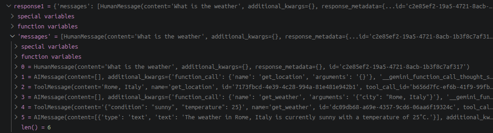

Vemos que `response1` contiene mensajes entre el humano y la IA. La IA tiene bastantes mensajes, eligiendo las tools y devolviendo la respuesta final al usuario.

De aquí sacamos otro forma de explicar qué es un agente. Es una IA que ejecuta tools en bucle hasta producir la respuesta para el usuario.

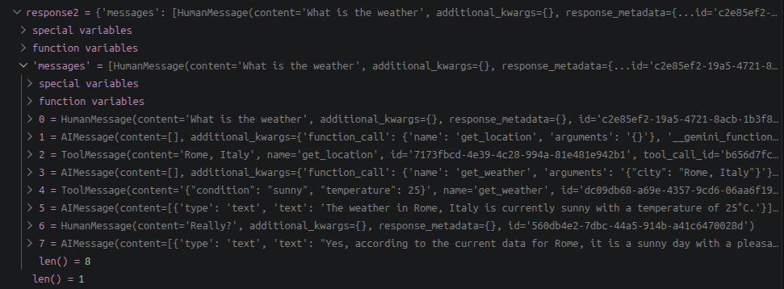

Vemos que `response2` contiene también la primera pregunta del usuario y la contestación del agente (los 6 mensajes que había en `response1`) más la nueva pregunta del usuario y la respuesta de la IA.

Por tanto, la forma en la que funciona la memoria es que, cuando se invoca un agente, la lista completa de mensajes se envía al LLM, no solo la última pregunta del usuario, sino todo. Así la IA es capaz de conocer el contexto.

### AI Agents with Multiple Conversations

En el código

```python
response1 = agent.invoke({"messages": [{'role': 'user', 'content': user_query1}]},
                         {"configurable": {"thread_id": "1"}})
```

hay que indicar que `thread_id` puede valer cualquier número, y todas las respuestas producidas con ese `thread_id` estarán conectadas entre sí. Esto significa que podemos crear más `thread_id` si queremos mantener varias conversaciones.

Es importante indicar que el agente siempre es el mismo objeto, pero manejando diferentes ramas de conversación con `thread_id` diferentes.

Podemos probar con las siguientes preguntas:

- Where am I?
- Really?
- What does it tell you?
  - Esta última conversación no tiene ni idea de las dos preguntas/respuestas anteriores.

En aplicaciones del mundo real no tenemos los valores de `thread_id` en duro. Si tenemos un chatbot y se conectan dos usuarios distintos, cada uno tendrá su `thread_id` distinto. Algo así:

`"thread_id": f"{username}_random_number¨`

Y cada invocación para el mismo usuario tendría el mismo `thread_id`.

### Continuous Agent Conversation with Memory

Vamos a implementar una conversación continua con nuestro agente usando un bucle `while`.

Ver `main_loop.py`.

Ejecutar `python main_loop.py`.

Podemos probar con las siguientes preguntas:

- Where am I?
- What is the weather in that city?
- Do I need a jacket?

En esta sección hemos visto como dotar de memoria al agente. Sin embargo, estas conversaciones se almacenan de manera temporal en la sesión de Python. Si más adelante queremos continuar la conversación donde la dejamos en un día anterior, no podremos, porque la conversación está almacenada en la variable diccionario `response` y se borra cuando termina la ejecución del script.

En la siguiente sección vamos a guardar estas conversaciones en ficheros y en BD.

## Building AI Agents with Persistent Database Memory

### Introduction

En esta sección vamos a implementar memoria persistente de dos formas distintas:

- Usando SQLite.
- Usando mi Raspberry Pi donde tengo PostgreSQL, que es la solución de BD de producción estándar para programas Python.

### Saving and Retrieving History in SQLite Database

Vamos a implentar memoria persistente en el agente, de forma que, cuando se cierre el programa y se vuelva a abrir, el usuario puede continuar la conversación.

En la carpeta `00-Projects/05-Building-AI-Agents-With-Persistent-Database-Memory-SQLite` se ha creado el fichero `main_sqlite.py` donde vamos a codificar nuestro agente con memoria persistente, usando SQLite.

Hacer las instalaciones en nuestro virtual environment usando `pip install -r requirements.txt`.

Ejecutar `python main_sqlite.py`.

Si, al ejecutar ocurre algún error, indicar que hay que actualizar a la vez `langgraph` y `langchain` así: `pip install --upgrade langchain langgraph langchain-core`.

Podemos probar con las siguientes preguntas:

- Where am I?
- bye
  - Con esto nos salimos
- Volvemos a ejecutar el programa
- And, what is the weather there?
  - Y nos contesta correctamente porque tiene el historial.
- bye
- Volvemos a ejecutar el programa
- Really?
  - Y nos contesta correctamente porque tiene el historial.

He bajado un driver de SQLite para conectarme a BD de SQLite y, en Squirrel, he configurado el acceso. Así se ve la configuración y los datos que contiene este ejemplo:

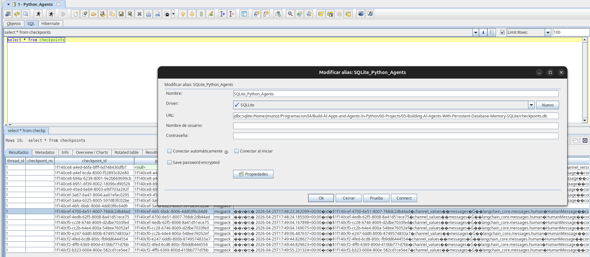

### Architecture Using a PostgreSQL Database

En esta clase vamos a conectar nuestra app a la BD PostgreSQL.

- Me he conectado al contenedor: `docker exec -it postgres_database psql -U postgres`.
- He creado la BD weather: `CREATE DATABASE weather;`.
- Para ver la lista de BD: `\l`

En la carpeta `00-Projects/06-Building-AI-Agents-With-Persistent-Database-Memory-PostgreSQL` se ha creado el fichero `main_postgre.py` donde vamos a codificar nuestro agente con memoria persistente, usando SQLite.

Hacer las instalaciones en nuestro virtual environment usando `pip install -r requirements.txt`.

Ejecutar `python main_postgre.py`.

Si, al ejecutar ocurre algún error, indicar que hay que actualizar a la vez `langgraph` y `langchain` así: `pip install --upgrade langchain langgraph langchain-core`.

Podemos probar con las siguientes preguntas:

- How is the weather?
- bye
  - Con esto nos salimos
- Volvemos a ejecutar el programa
- And, what is the weather there?
  - Y nos contesta correctamente porque tiene el historial.
- bye
- Volvemos a ejecutar el programa
- Really?
  - Y nos contesta correctamente porque tiene el historial.

En Squirrel, podemos crear la conexión y ejecutar la consulta `select * from checkpoints;`.

## Making an AI Agent Web App

### Introduction

Vamos a construir una web app para nuestra API con agente IA, usando Flask.

### From CLI to Web App

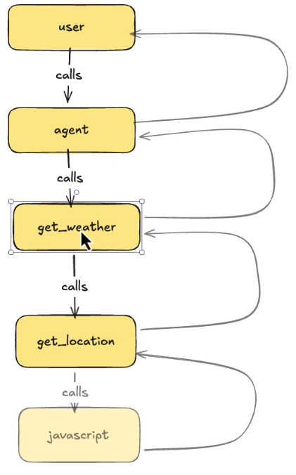

En la carpeta `00-Projects/07-Making-an-AI-Agent-Web-App` se ha creado:

- El fichero `app.py` con la parte web hecha en Flask.
- El fichero `agent.py` donde dejamos la API con el agente.
- Creamos el directorio `templates`
  - Dentro creamos el archivo `chat.html`
    - Contiene CSS.
    - Contiene código JavaScript que va a ser llamado desde `agent.py`, de la función `get_location()`.

Hacer las instalaciones en nuestro virtual environment usando `pip install -r requirements.txt`.

- Ejecutar `python app.py`
- Abrir un navegador a la ruta http://127.0.0.1:5000/

## Self-Hostable Models

Vamos a aprender como usar modelos LLM locales.

Vamos a usar la herramienta estándar, Ollama.

### Overview of Available Self-hostable Models

Hay dos tipos de LLMs a la hora de hablar dónde están instalados.

- En servidores remotos: Hablamos de los grandes modelos de lenguaje, como ChatGPT, Gemini, Claude...
  - Se accede a estos modelos usando API, y hay que indicar la API key de ese modelo a, por ejemplo, LangChain.
  - Son de pago.
- Locales: Son modelos que podemos instalar en nuestro ordenador o en un servidor privado, como Llama, Gemma4, Qwen3, DeepSeek, Mistral...
  - Conseguimos privacidad y son gratis.

### Using the Local Model Through Python and LangChain

Vamos a hacer un script que accede a un modelo LLM local.

Usaremos un modelo descargado en Ollama, porque también es un servidor API. Se puede comprobar accediendo en un navegador a la url: http://localhost:11434 donde veremos el texto `Ollama is running`, es decir, que el API server está ejecutándose y esperando peticiones.

Para conectar Python con este server, necesitamos las librerías `langchain` y `langchain-ollama`, sobre todo esta última.

En la carpeta `00-Projects/08-Self-Hostable-Models` se ha creado el fichero `main.py`.

Hacer las instalaciones en nuestro virtual environment usando `pip install -r requirements.txt`.

Ejecutar `python main.py`.

## Building Your Own LLM Service

Vamos a construir nuestra propia API con nuestro modelo LLM para que cualquier programa pueda conectarse al modelo y lo consuma, usando nuestra API.

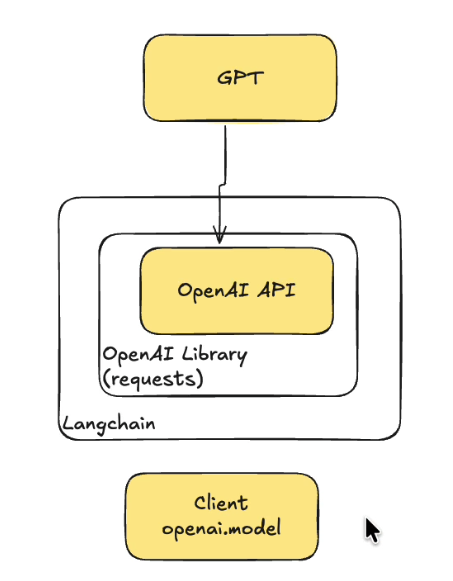

Vamos a usar Langchain, que es un wrapper alrededor de la librería OpenAI (o el modelo que sea) que a su vez es un wrapper de la API de OpenAI (o el modelo que sea) que es quien se conecta realmente al modelo.

Nuestro cliente, por tanto, se conecta con Langchain.

Para nuestro modelo, la arquitectura es casi igual:

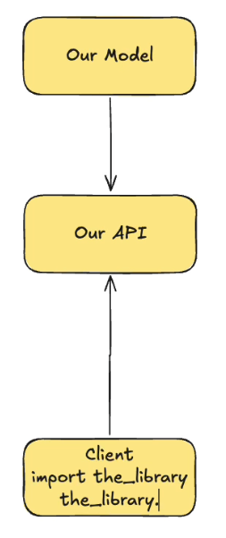

### Building de API

En la carpeta `00-Projects/09-Building-Your-Own-LLM-Service` se ha creado:

- El fichero `main.py`
  - Se usa Flask para construir la Rest API.
- El fichero `client.py`
  - Se ha creado un diccionario para mantener un historial de la conversación.

Hacer las instalaciones en nuestro virtual environment usando `pip install -r requirements.txt`.

- Ejecutar `python main.py` y `python client.py` en terminales distintas.

### Building de API with Streams

En la carpeta `00-Projects/10-Building-Your-Own-LLM-Service-With-Streams` se ha creado:

- El fichero `main.py`
  - Se usa Flask para construir la Rest API.
- El fichero `client.py`
  - Se ha creado un diccionario para mantener un historial de la conversación.

Hacer las instalaciones en nuestro virtual environment usando `pip install -r requirements.txt`.

- Ejecutar `python main.py` y `python client.py` en terminales distintas.

## Getting Structured Output from LLMs

### Why Do We Need Structured Data?

En esta sección vamos a obtener data de salida estructurada de un LLM, usando Python.

Lo que queremos decir con data estructurada es que, hasta ahora, hemos obtenido texto plano de un LLM (formato Markdown), en el que el LLM decide cuando el texto estará en negrita o formará parte de una lista de puntos, etc., y esto no es data estructurada.

Lo que vamos a hacer es instruir al LLM para que nos devuelva una estructura JSON. El beneficio que esto nos aporta es que ahora podemos decidir como mostrar la data.

### How It All Works

Vamos a ver la arquitectura de un programa que usa LLM y devuelve una salida estructurada usando el formato JSON.

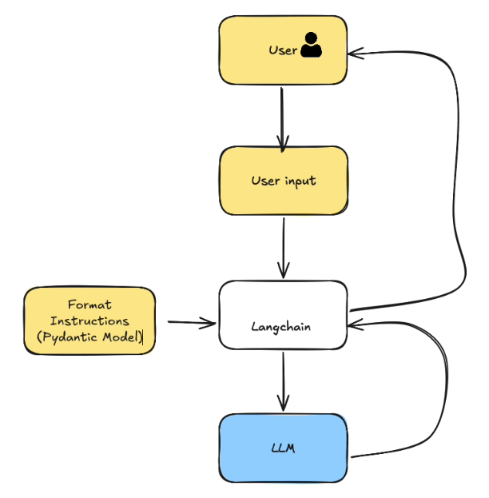

Como vemos en la imagen, hay una instrucciones de formato que tiene el nombre de `Pydantic Model`. Es como una plantilla de la data que queremos. Langchain coge la entrada del usuario y este `Pydantic Model` y se lo pasa al LLM, que dará una respuesta usando esa plantilla. Esa información va a Langchain y este devuelve la salida al usuario.

### Returning Structured Output with Langchain

Usaremos la librería `pydantic`.

En la carpeta `00-Projects/11-Getting-Structured-Output-From-LLM` se ha creado:

- El fichero `recipe_generator.py`

Hacer las instalaciones en nuestro virtual environment usando `pip install -r requirements.txt`.

- Ejecutar `python recipe_generator.py`.

### Returning Structured Output from Agents

Vamos a ver como tener un agente que devuelva salida estructurada.

Volvemos a usar la librería `pydantic`.

En la carpeta `00-Projects/11-Getting-Structured-Output-From-LLM` se ha creado:

- El fichero `agent_structured.py`

Hacer las instalaciones en nuestro virtual environment usando `pip install -r requirements.txt`.

- Ejecutar `python agent_structured.py`.

## Project: Spreadsheet and AI Automation

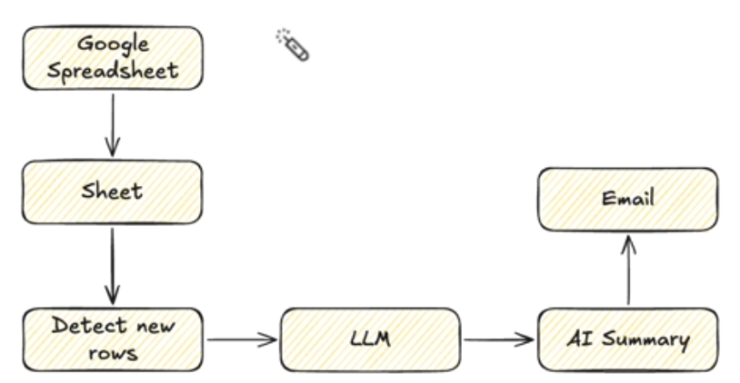

Vamos a construir un proceso de automatización completo.

En la carpeta `00-Projects/12-Spreadsheet-And-AI-Automation` se ha creado:

- El fichero `main.py`

Hacer las instalaciones en nuestro virtual environment usando `pip install -r requirements.txt`.

- Ejecutar `python main.py`.

Necesitaremos una API Key de Google Console: https://console.cloud.google.com/apis/dashboard

Necesitaremos un acceso a Gmail: https://myaccount.google.com/security

Acceder a Google Sheets: https://drive.google.com/drive/home

## Project: Viewing and Editing Private Google Sheets with Python

Vamos a usar Python para acceder a Google Sheets privados, lo que significa cargar data, añadir filas y editarlas en Google Sheets usando Python.

En la carpeta `00-Projects/13-Viewing-and-Editing-Private-Google-Sheets-with-Python` se ha creado:

- El fichero `view_rows.py`
- El fichero `add_rows.py`
- El fichero `edit_rows.py`
- Una service Keys (xxxxxx.json)

Hacer las instalaciones en nuestro virtual environment usando `pip install -r requirements.txt`.

- Ejecutar `python view_rows.py`.
- Ejecutar `python add_rows.py`.
- Ejecutar `python edit_rows.py`.

Necesitaremos una Key de Google Console (creada en Service Accounts): https://console.cloud.google.com/iam-admin/serviceaccounts

Descargamos en json el archivo de esa key.

Acceder a Google Sheets y crear un spreadsheet: https://drive.google.com/drive/home

La key que creamos tiene un Email. Damos acceso en el Spreadsheet a ese Email.

## Interpreting Images with Python & LLMs

### Introduction

Vamos a ver como interpretar imágenes usando Python y modelos de IA.

En esta primera sección sobre interpretación de imágenes, solo vamos a preguntar al modelo qué ve en la imagen.

### Interpreting Images with Google Gemini Models

En la carpeta `00-Projects/14-Interpreting-Images-with-Python-and-LLMs` se ha creado:

- El fichero `text_query_gemini.py`

Hacer las instalaciones en nuestro virtual environment usando `pip install -r requirements.txt`.

- Ejecutar `python text_query_gemini.py`.

### Interpreting Images with OpenAI Models

Crear una API KEY de OPENAI en esta web: https://platform.openai.com/home

En la carpeta `00-Projects/14-Interpreting-Images-with-Python-and-LLMs` se ha creado:

- El fichero `text_query_openai.py`

Hacer las instalaciones en nuestro virtual environment usando `pip install -r requirements.txt`.

- Ejecutar `python text_query_openai.py`.

## Project: Building a Recipe Generator from Images AI App

### What We Will Build

Construiremos una web app que usa el concepto de interpretación de imágenes con LLMs usando Python.

En concreto, es un generador de recetas, al que subiremos una imagen, o cogeremos una imagen con la cámara, o incluso pegaremos una imagen desde el portapapeles de distintos ingredientes, y el LLM nos dirá que ingredientes ve y propondrá tres recetas.

### Creating the Recipe Generator Web App

Vamos a usar `Gradio`. Es un framework web usado para construir apps web de ciencia de datos y apps web AI.

En la carpeta `00-Projects/15-Building-a-Recipe-Generator-from-Images` se ha creado:

- El fichero `gradio_app.py`

Hacer las instalaciones en nuestro virtual environment usando `pip install -r requirements.txt`.

- Ejecutar `python gradio_app.py`, o, mejor todavía, usando el comando `gradio gradio_app.py`, que permite recarga de la página si se hacen cambios.

## Image Generation with Python and AI

### What You Will Learn

Vamos a ver como generar imágenes usando modelos de OpenAI.

### OpenAI Platform Pricing and Models Overview

Acceder a OPENAI en esta web: https://platform.openai.com/home

Página de desarrolladores: https://developers.openai.com/api/docs

Modelo de imágenes: https://developers.openai.com/api/docs/models/gpt-image-2

Precio de distintos modelos: https://developers.openai.com/api/docs/pricing

### Generating Images with Open AI Models

Vamos a crear un programa que obtiene una entrada de texto del usuario y crea una imagen usando IA a partir de esa entrada.

En la carpeta `00-Projects/16-Image-Generation-with-Python-and-AI` se ha creado:

- El fichero `imagen_gen_openai.py`

Hacer las instalaciones en nuestro virtual environment usando `pip install -r requirements.txt`.

- Ejecutar `python imagen_gen_openai.py`.

## Building an AI Voice Assistant

### What We Will Build

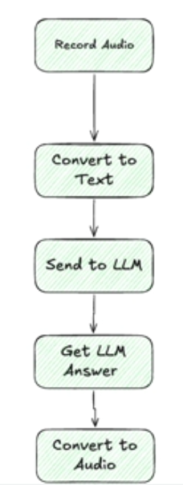

Los pasos son:

- Grabar audio.
- Convertirlo a texto.
- Enviarlo a un LLM (OpenAI).
- Obtener la respuesta del LLM.
- Volver a convertirlo a audio.
- Escuchar el audio.

Todo se va a hacer en la terminal.

### Record Audio with Python

En la carpeta `00-Projects/17-Building-an-AI-Voice-Assistant` se ha creado:

- El fichero `main.py`

Hacer las instalaciones en nuestro virtual environment usando `pip install -r requirements.txt`.

- Ejecutar `python main.py`.

### Convert Speech to Text with OpenAI

En la carpeta `00-Projects/17-Building-an-AI-Voice-Assistant` seguimos trabajando con:

- El fichero `main.py`
- Ejecutar `python main.py`.

### Sending the Converted Text to the LLM

En la carpeta `00-Projects/17-Building-an-AI-Voice-Assistant` seguimos trabajando con:

- El fichero `main.py`
- Ejecutar `python main.py`.

### Text to Speech Conversion with OpenAI

Para ver las voces que ofrece OpenAI: https://developers.openai.com/api/docs/guides/text-to-speech

En la carpeta `00-Projects/17-Building-an-AI-Voice-Assistant` seguimos trabajando con:

- El fichero `main.py`
- Ejecutar `python main.py`.

## Building Document Context Injection System

### What We Will Build

Vamos a ver como construir sistemas RAG con Python y Langchain.

¿Qué es un sistema RAG?

RAG (Retrieval-Augmented Generation) es una técnica donde un LLM consulta documentación o datos externos antes de responder. Consiste en:

- Tener documentos almacenados.
- Buscar los fragmentos relevantes para cada pregunta.
- Pasárselos al modelo.
- Generar la respuesta usando ese contexto.

Por ejemplo:

- Tienes PDFs de seguros en BD, normas internas o manuales.
- El usuario pregunta:
  - “¿Cuál es el plazo de devolución de un recibo?”
- El sistema busca en los documentos.
- Recupera los trozos relevantes.
- El LLM responde usando esos fragmentos.

Ahí está el “Retrieval” de RAG.

### The Architecture of the System

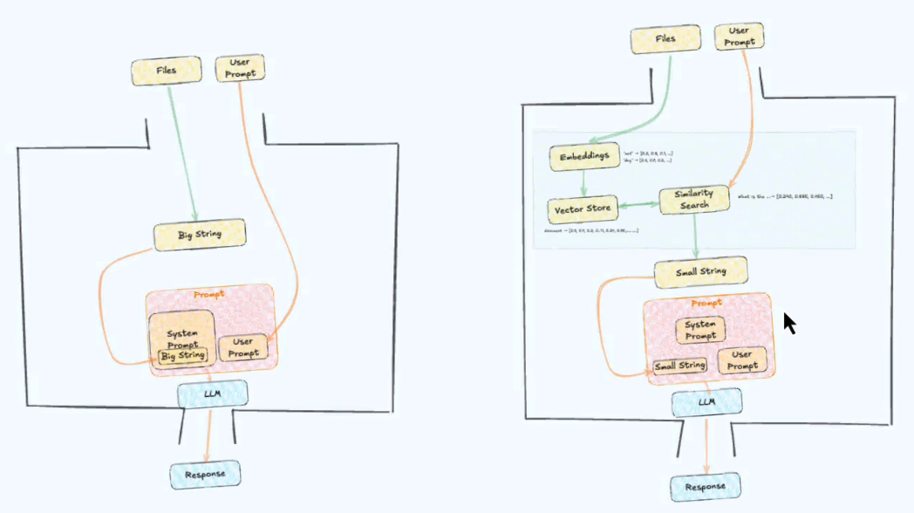

En la imagen se ven dos arquitecturas para construir sistemas RAG.

1. Una forma sencilla para los que comienzan en la parte izquierda de la imagen.
2. La forma en la que debe quedar a nivel de producción.

**Vamos a ver la primera forma**

- Los inputs son:
  - Files: Son los documentos
  - User Prompt: La pregunta que lanza el usuario sobre la información.
- El sistema:
  - Usa Python para cargar el contenido de esos ficheros.
    - Abre los ficheros PDS y los ficheros de texto y crea un único String gigante con todo, `Big String` en la imagen.
  - Ese String se inyecta en el `Prompt`, donde ahora tenemos:
    - System Prompt + Big String
    - User Prompt
  - `System Prompt`, que contiene `Big String`, y `User Prompt`, se envían al LLM, en este caso uno de los modelos de Gemini,
    - `System Prompt` es algo del estilo: `Eres un asistente útil, aquí están los documentos.`. Indica como debe comportarse el modelo y se le pasa `Big String`.
    - Se le pasa `User Prompt` con la pregunta del usuario.
- El LLM tiene ahora todo el contexto y genera la respuesta.

Esto NO es realmente un RAG porque no hay paso de `Retrieval`. Es más bien una inyección de contexto.

Aunque el comportamiento es el mismo, el paso de `Retrieval` hace el sistema más eficiente (ahorra tokens y por tanto dinero)

Veremos paso de `Retrieval` al explicar la imagen de la derecha.

### Initializing the LLM

En la carpeta `00-Projects/18-Building-Document-Context-Injection-System` se ha creado:

- El fichero `main.py`

Hacer las instalaciones en nuestro virtual environment usando `pip install -r requirements.txt`.

- Ejecutar `python main.py`.

### System Prompt and Context Injection

Vamos a construir el `System Prompt`, que contiene el `Big String`.

En la carpeta `00-Projects/18-Building-Document-Context-Injection-System` seguimos trabajando con:

- El fichero `main.py`
- Ejecutar `python main.py`.

### Loading the Documents

Vamos a cargar los documentos deseados para montar `Big String`.

En la carpeta `00-Projects/18-Building-Document-Context-Injection-System` seguimos trabajando con:

- El fichero `main.py`
- Existe el directorio `My Documents` con los ficheros que queremos que formen parte de `Big String.
- Ejecutar `python main.py`.

### Creating the Context

En la carpeta `00-Projects/18-Building-Document-Context-Injection-System` seguimos trabajando con:

- El fichero `main.py`
- Ejecutar `python main.py`.

### Getting Answers from the LLM About the Documents

En la carpeta `00-Projects/18-Building-Document-Context-Injection-System` seguimos trabajando con:

- El fichero `main.py`
- Ejecutar `python main.py`.

### Implementing Continuous Conversation Documents

Mejora para poder seguir conversando, es decir, hacerlo más interactivo manteniendo el historial, porque hasta ahora solo se podía hacer una pregunta y el programa terminaba.

En la carpeta `00-Projects/18-Building-Document-Context-Injection-System` seguimos trabajando con:

- El fichero `main.py`
- Ejecutar `python main.py`.

Preguntas:

- When where the short term investment higher for Rabbit?
- What is the diff between the two?

## Project: Building a Full RAG System

### How a RAG Works


Nos centramos ahora en la imagen de la derecha, que contiene el diagrama de arquitectura de un sistema RAG real.

Un sistema RAG real contiene la parte Retrieval, que en la imagen vemos como:

- Embeddings
- Vector Store
- Similarity Search

En la inyección de contexto que se puede ver en la parte izquierda de la imagen, en donde inyectamos un String con todos los documentos concatenados, se gastan muchísimos tokens.

En nuestro RAG real, la parte Retrieval realiza un preprocesamiento de forma que, antes de enviar la data al LLM, primero realizamos un filtrado usando `similarity search` para comprobar el `user prompt` contra los documentos, sin usar el LLM y sin gastar tokens.

Con esto obtenemos solo la porción de documentos que es realmente relevante al `user prompt`. Lo demás no se carga.

Por eso, en la imagen de la derecha, vemos `Small String`, porque no es una concatenación de todos los documentos, sino solo de los documentos relevantes al `user prompt`.

Con esto, ahorramos tokens, es decir, dinero, y el LLM solo trabaja con data que es realmente importante.

### Setting Up the LLM

En la carpeta `00-Projects/19-Building-a-Full-RAG-System` se ha creado:

- El fichero `main.py`
  - Solo dejamos configurado el LLM.

Hacer las instalaciones en nuestro virtual environment usando `pip install -r requirements.txt`.

- Ejecutar `python main.py`

### Setting Up Embeddings and Vector Store

Lo primero que vamos a hacer es configurar `embeddings` y `vector store`.

En la carpeta `00-Projects/19-Building-a-Full-RAG-System` seguimos trabajando con:

- El fichero `main.py`
  - Vamos a obtener el contexto, pero solo la parte relevante de los documentos.
  - Vemos en la imagen de la derecha del RAG como `user prompt` va a `similarity search` y este hace una búsqueda en `vector store`, que se ha construido usando `embeddings`, que a su vez se han construido usando `files`, es decir nuestros documentos.
  - Dicho al revés, tenemos documentos que se convierten en `embeddings`, y estos se transforman en `vector store` sobre el que se aplica `similarity search` a partir del `user prompt`.

### Creating Embeddings from Documents

Vamos a cargar los documentos en el `vector store`.

En la carpeta `00-Projects/19-Building-a-Full-RAG-System` seguimos trabajando con:

- El fichero `main.py`
- Ejecutar `python main.py`

### Getting Answers from the RAG

Usando `user prompt`, vamos a aplicar `similarity search` sobre `vector store` para extraer la información que realmente llevaremos al LLM y sobre la que razonará el modelo.

En la carpeta `00-Projects/19-Building-a-Full-RAG-System` seguimos trabajando con:

- El fichero `main.py`
- Ejecutar `python main.py`

Hacer la siguiente pregunta:

- What are land assets of rabbit?

## Agents with Web Search Capabilities

### What We Will Build

Cuando usamos Python para preguntar a un LLM y obtener la respuesta, por defecto no obtenemos la última información sobre un tema.

Vamos a ver como cambiar la configuración para obtener la última información sobre un tema, haciendo scrapping.

Además, vamos a combinar los artículos que obtengamos para obtener un artículo completo a partir de dichos artículos, siempre indicando las fuentes.

### Setting Things Up

Para hacer las búsquedas en la Web y poder obtener la información más reciente sobre un tema, usaremos `langchain-tavily`.

### What is Tavily

Web: https://www.tavily.com/

Tenemos que hacernos una cuenta. Automáticamente tendremos una API Key.

Documentación: https://docs.tavily.com/documentation/about

Tavily nos da 1000 créditos gratuitos al mes al crear una cuenta.

Un credit es, básicamente, una búsqueda básica en la web.

Hay dos servicios principales:

- Tavily Search: Lo que vamos a usar.
  - Proveemos una query al programa y este usará Tavily Search para devolver resultados relevantes en forma de URL y snippets de información (resumen de la página web).
- Tavily Extract
  - Espera URLs y Tavily hará scrapping de esas páginas web.

### Coding A Script That Searches on the Web

Formato de respuesta: https://docs.tavily.com/sdk/python/reference#response-format-2

En la carpeta `00-Projects/20-Agent- with-Web-Search-Capabilities` se ha creado:

- El fichero `main.py`

Hacer las instalaciones en nuestro virtual environment usando `pip install -r requirements.txt`.

- Ejecutar `python main.py`

### Performing Multiple Searches and Generating Articles Based on Tavily Results

Mejoramos el programa anterior conectando el modelo de Google Gemini para interpretar estos resultados y crear un artículo a partir de ellos.

En la carpeta `00-Projects/20-Agent- with-Web-Search-Capabilities` se ha creado:

- El fichero `main_multiple_searches.py`
- Ejecutar `python main_multiple_searches.py`
- Se genera un archivo `article.md` con un artículo basado en la respuesta.

## Project: Building a Local AI Agent (Claude Code Clone)

### What We Will Build

Vamos a construir un agente IA con Python que hace cosas parecidas a Claude Code.

### The Agent React Pattern

Vamos a var la arquitectura de este agente IA.

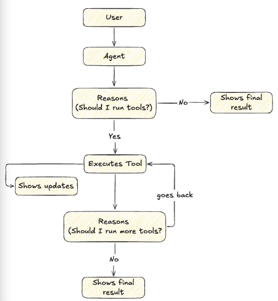

La parte que va de` Executes Tool` a `Reasons (Should I run more tools?)`, a ese bucle, se le conoce como `React Tool`. Consiste en razonamiento y actuación.

### Creating a Simple Agent

En la carpeta `00-Projects/21-Building-a-Local-AI-Agent` se ha creado:

- El fichero `local_ai_agent.py`

Hacer las instalaciones en nuestro virtual environment usando `pip install -r requirements.txt`.

- Ejecutar `python local_ai_agent.py`

### Adding File Access Capability

En la carpeta `00-Projects/21-Building-a-Local-AI-Agent` seguimos trabajando con:

- El fichero `local_ai_agent.py`
- Ejecutar `python local_ai_agent.py`

### Streaming Agent Updates

Mostraremos los textos con el razonamiento del modelo, para que el usuario sepa un poco qué se va haciendo.

Usando `agent.stream()` obtenemos los `agent updates`.

En la carpeta `00-Projects/21-Building-a-Local-AI-Agent` seguimos trabajando con:

- El fichero `local_ai_agent.py`
- Ejecutar `python local_ai_agent.py`

### Streaming Updates on Tool Use

Vamos a interar sobre el generator de diccionarios que deuvelve el streaming e imprimir el primer paso de cada elemento (la tool usada, correspondiente a `step = 'model'`)

En la carpeta `00-Projects/21-Building-a-Local-AI-Agent` seguimos trabajando con:

- El fichero `local_ai_agent.py`
- Ejecutar `python local_ai_agent.py`

### Streaming Updates on Tool Call Results

Imprimimos el segundo paso para cada elemento (los resultados de la tool, correspondiente a `step = 'tools'`)

En la carpeta `00-Projects/21-Building-a-Local-AI-Agent` seguimos trabajando con:

- El fichero `local_ai_agent.py`
- Ejecutar `python local_ai_agent.py`

### Display the Final Agent Answer

Devolvemos el mensaje final generado por el agente IA.

En la carpeta `00-Projects/21-Building-a-Local-AI-Agent` seguimos trabajando con:

- El fichero `local_ai_agent.py`
- Ejecutar `python local_ai_agent.py`

## Project: Polishing the Local AI Agent

### What We Will Build

Vamos a dejar el proyecto `21-Building-a-Local-AI-Agent` más parecido a como sería Claude Code en cuanto a diseño, y vamos a añadir más tools.

### Stylizing the Agent Outputs in the Console

Utilizamos la biblioteca `rich`, que ya aparece en `requirements.txt`. Nos permite añadir atributos de color, etc. a las salidas en consola.

En la carpeta `00-Projects/21-Building-a-Local-AI-Agent` seguimos trabajando con:

- El fichero `local_ai_agent.py`
- Ejecutar `python local_ai_agent.py`

### Stylizing the Main Agent Answer

Con la biblioteca `rich`, vamos a usar un panel y markdown para mostrar la respuesta del agente.

En la carpeta `00-Projects/21-Building-a-Local-AI-Agent` seguimos trabajando con:

- El fichero `local_ai_agent.py`
- Ejecutar `python local_ai_agent.py`

### Adding Write-file Capability to the Agent

Añadimos una nueva tool para que el agente pueda crear ficheros.

En la carpeta `00-Projects/21-Building-a-Local-AI-Agent` seguimos trabajando con:

- El fichero `local_ai_agent.py`
- Ejecutar `python local_ai_agent.py`

### Adding Read-file and Create-directory Privileges

Añadimos una nueva tool para que el agente pueda leer ficheros y crear directorios.

En la carpeta `00-Projects/21-Building-a-Local-AI-Agent` seguimos trabajando con:

- El fichero `local_ai_agent.py`
- Ejecutar `python local_ai_agent.py`

### Finalizing the Agent

Añadimos gestión de errores.

En la carpeta `00-Projects/21-Building-a-Local-AI-Agent` seguimos trabajando con:

- El fichero `local_ai_agent.py`
- Ejecutar `python local_ai_agent.py`
